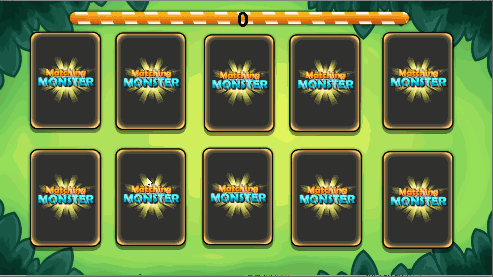

# Konsep Game Card Match

Setelah mengenal bagaimana cara menggunakan Construct 2 dengan materi cara membuat permainan "Space Shooter". Sekarang akan membahas bagaimana caranya membuat permainan "Card Match" atau mencocokkan kartu.

Di modul ini Anda akan mempelajari tentang Instance Variable, Array, Perulangan, Timer, dan Spritefont+ yang sudah didesain sederhana.

**Berikut materi-materi yang akan kita bahas dalam modul ini :**

1. [Membuat Objek Kartu](002_object_kartu.md)
2. [Menambahkan Instance Variable Global Variable](003_instance_variabel.md)
3. [Membuat Fungsi Pengacakan](004_pengacakan.md)
4. [Membuat Fungsi Kartu Dibuka](005_kartu_dibuka.md)
5. [Menampilkan Score](006_menampilkan_score.md)
6. [Membuat Timer](007_timer.md)
7. [Spritefont+](008_spritefont.md)
8. [Menambahkan Kondisi Game Over](009_game_over.md)
9. [Export ke HTML5](010_export_html5.md)
